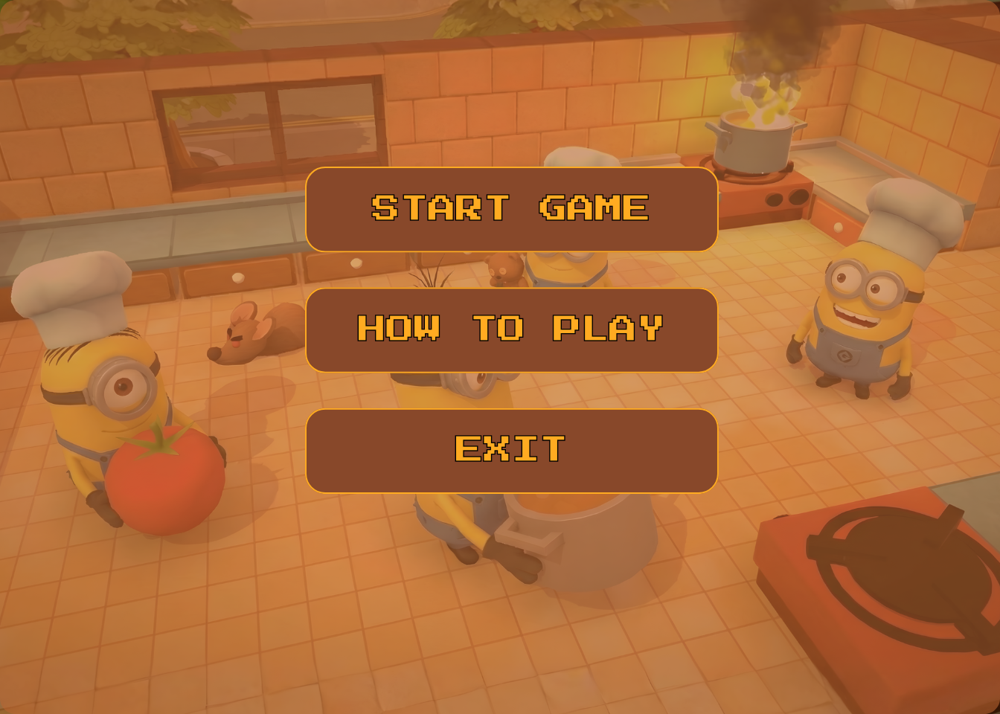

# 🍳 NimonsCooked

**NimonsCooked** is a 2D co-op cooking simulation game built from scratch using **Java** and **Swing**. Inspired by *Overcooked!*, this project was developed as a final assignment for the Object-Oriented Programming (OOP) course.

The goal is simple: manage two chefs in a chaotic kitchen, prepare ingredients, cook recipes, and serve customers before time runs out.



## 🎮 How to Play

You control **two chefs** (Minions) in a kitchen. Since it's a single-player game controlling two characters, you need to switch between them to multitask effectively.

**Core Loop:**
1.  **Fetch Ingredients:** Get raw items like Meat, Fish, or Pasta from the crates.
2.  **Prep:** Chop vegetables at the *Cutting Station*.
3.  **Cook:** Boil pasta or fry ingredients at the *Cooking Station*. Watch out—food will burn if left too long!
4.  **Plate & Serve:** Put ingredients on a plate and deliver it to the *Serving Counter*.
5.  **Wash:** Dirty plates return after serving. You must wash them at the *Sink* before reusing them.

### 🕹️ Controls

| Key | Action | Description |
| :--- | :---: | :--- |
| **W, A, S, D** | Move | Move the currently active chef. |
| **E** | Interact | Use a station (Chop, Wash, Start Cooking). |
| **Q** | Pick Up / Drop | Grab an item, place it on a table, or give it to the other chef. |
| **TAB** | Switch Chef | Toggle control between Chef 1 and Chef 2. |

---

## 🛠️ Installation & How to Run

### Prerequisites
* Java Development Kit (JDK) 8 or higher.
* An IDE (IntelliJ IDEA, Eclipse, or VS Code) or Terminal.
* Maven (Optional, but recommended)
* **Clone the repository**
    ```bash
    git clone [https://github.com/astebern/OOP-K01-C.git](https://github.com/astebern/OOP-K01-C)
    cd nimonscooked
    ```

### Method 1: Using Maven (Recommended)
1. **Open your terminal in the project root.**
2. **Compile the Project:**
    ```bash
    mvn clean compile
    ```
3. **Run the Game:**
    ```bash
    mvn exec:java
    ```
  
### Method 2: Manual Compilation
 **If you don't have Maven, you can compile it manually:**
    ```bash
    javac -d bin -sourcepath src/main/java src/main/java/core/Main.java
    java -cp bin core.Main
    ```

## 🛠️ Technical Overview

This project implements key OOP concepts and Java features required for the course:

* **OOP Principles:**
    * **Inheritance:** `Item` is the parent class for `Ingredient`, `KitchenUtensil`, and `Dish`. `Station` is the base class for all kitchen stations.
    * **Polymorphism:** The `Chef` class interacts with `Item` and `Station` generically, allowing different behaviors depending on the specific subclass.
    * **Interfaces:** Uses `Preparable` (for chop/cook logic) and `CookingDevice`.
* **Design Patterns:**
    * **Singleton:** Used in `GameMaster` to manage the global game state.
    * **State Pattern:** Manages ingredient states (`RAW` -> `CHOPPED` -> `COOKED` -> `BURNED`).
* **Concurrency:** Multithreading is used for the main game loop, as well as for timed actions like cooking and washing logic.
* **Collections:** Uses `Stack` for plates, `Queue` for orders, and `List` for managing entities.

## 📂 Project Structure

```text
src/main/java
├── core/           # Entry point, Game Loop, and Input Handling
├── entities/       # Chef logic and movement
├── items/          # Logic for Ingredients and Utensils
├── map/            # Tile-based map rendering and collision
├── stations/       # Logic for specific stations (Cutting, Cooking, Washing)
└── utils/          # Helper classes (Enums, Position)

## 👥 Authors

* **[Nama Kamu / Tim Kamu]** - *Developer*

---
*Created for Object-Oriented Programming Course Final Project.*